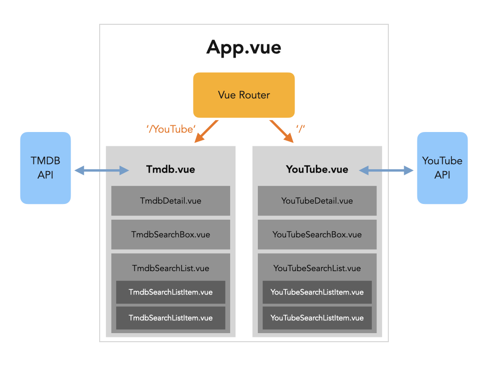

# [FrontEnd] 실시간 TMDB 검색창

> written by Root_Kwak on May, 2021
>
> * [TMDB API](https://developers.themoviedb.org/3)


## 1. 프로젝트 설명

* frontend : Vue.js

검색창에 연결된 `axios`를 통해 검색창에 `input` 이벤트가 발생할 때마다 비동기적으로 키워드 관련 영화 목록을 출력합니다.

영화 목록은 TMDB API를 이용했고, 템플릿 디자인은 아직 진행 전입니다.


## 2. 결과물

### 2-1. 설계도



### 2-2. 실행화면

(아직 진행중)


## 3. 개발환경

- OS : macOS Big Sur
- Python : Python 3.8.6
- 라이브러리 항목은 `package.json` 참고


## 4. 로컬 실행 방법

> 로컬에서 설치하려면 아래 방법을 순차적으로 실행하면 됩니다. (기본 로컬 서버 실행 주소 [127.0.0.1:8080](http://127.0.0.1:8000/))

```
$ npm install
$ npm run serve
```


Fin.